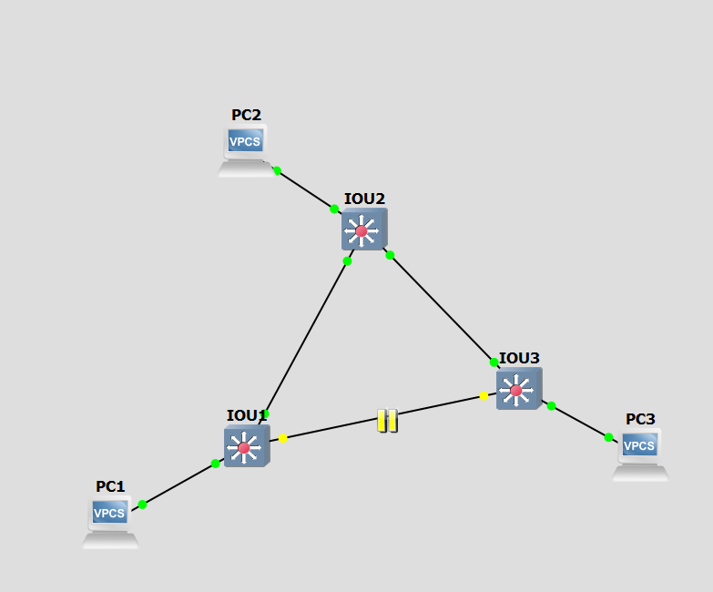

# TP6 : STP, OSPF, bigger infra
## I. STP
🌞 **Configurer STP sur les 3 switches**

- bon c'est surtout activé par défaut en 2023
- je veux bien un `show spanning-tree`
  - y'a forcément un port en état *BLK* là

```
IOU3#show spanning-tree

VLAN0001
  Spanning tree enabled protocol ieee
  Root ID    Priority    32769
             Address     aabb.cc00.0100
             Cost        100
             Port        3 (Ethernet0/2)
             Hello Time   2 sec  Max Age 20 sec  Forward Delay 15 sec

  Bridge ID  Priority    32769  (priority 32768 sys-id-ext 1)
             Address     aabb.cc00.0300
             Hello Time   2 sec  Max Age 20 sec  Forward Delay 15 sec
             Aging Time  300 sec

Interface           Role Sts Cost      Prio.Nbr Type
------------------- ---- --- --------- -------- --------------------------------
Et0/0               Desg FWD 100       128.1    P2p
Et0/1               Altn BLK 100       128.2    P2p
Et0/2               Root FWD 100       128.3    P2p
Et0/3               Desg FWD 100       128.4    P2p
Et1/0               Desg FWD 100       128.5    P2p
Et1/1               Desg FWD 100       128.6    P2p
Et1/2               Desg FWD 100       128.7    P2p
Et1/3               Desg FWD 100       128.8    P2p
Et2/0               Desg FWD 100       128.9    P2p
Et2/1               Desg FWD 100       128.10   P2p
Et2/2               Desg FWD 100       128.11   P2p
Et2/3               Desg FWD 100       128.12   P2p
Et3/0               Desg FWD 100       128.13   P2p
Et3/1               Desg FWD 100       128.14   P2p
Et3/2               Desg FWD 100       128.15   P2p
Et3/3               Desg FWD 100       128.16   P2p
```

🌞 **Altérer le spanning-tree** en désactivant un port

- désactiver juste un port de un switch pour provoquer la mise à jour de STP



- `show spanning-tree` pour voir la diff
```
IOU3#show spanning-tree

VLAN0001
  Spanning tree enabled protocol ieee
  Root ID    Priority    32769
             Address     aabb.cc00.0100
             Cost        200
             Port        2 (Ethernet0/1)
             Hello Time   2 sec  Max Age 20 sec  Forward Delay 15 sec

  Bridge ID  Priority    32769  (priority 32768 sys-id-ext 1)
             Address     aabb.cc00.0300
             Hello Time   2 sec  Max Age 20 sec  Forward Delay 15 sec
             Aging Time  300 sec

Interface           Role Sts Cost      Prio.Nbr Type
------------------- ---- --- --------- -------- --------------------------------
Et0/0               Desg FWD 100       128.1    P2p
Et0/1               Root FWD 100       128.2    P2p
Et0/2               Desg FWD 100       128.3    P2p
Et0/3               Desg FWD 100       128.4    P2p
Et1/0               Desg FWD 100       128.5    P2p
Et1/1               Desg FWD 100       128.6    P2p
Et1/2               Desg FWD 100       128.7    P2p
Et1/3               Desg FWD 100       128.8    P2p
Et2/0               Desg FWD 100       128.9    P2p
Et2/1               Desg FWD 100       128.10   P2p
Et2/2               Desg FWD 100       128.11   P2p
Et2/3               Desg FWD 100       128.12   P2p
Et3/0               Desg FWD 100       128.13   P2p
Et3/1               Desg FWD 100       128.14   P2p
Et3/2               Desg FWD 100       128.15   P2p
Et3/3               Desg FWD 100       128.16   P2p
```

🌞 **Altérer le spanning-tree** en modifiant le coût d'un lien

- modifier le coût d'un lien existant pour modifier l'arbre spanning-tree
```
IOU3#config
Configuring from terminal, memory, or network [terminal]?
Enter configuration commands, one per line.  End with CNTL/Z.
IOU3(config)#interface ethernet0/2
IOU3(config-if)#spanning-tree vlan 1 port-priority 50
% Port Priority in increments of 16 is required

IOU3(config-if)#spanning-tree vlan 1 port-priority 16
```
```
IOU3#show spanning-tree

VLAN0001
  Spanning tree enabled protocol ieee
  Root ID    Priority    32769
             Address     aabb.cc00.0100
             Cost        100
             Port        3 (Ethernet0/2)
             Hello Time   2 sec  Max Age 20 sec  Forward Delay 15 sec

  Bridge ID  Priority    32769  (priority 32768 sys-id-ext 1)
             Address     aabb.cc00.0300
             Hello Time   2 sec  Max Age 20 sec  Forward Delay 15 sec
             Aging Time  300 sec

Interface           Role Sts Cost      Prio.Nbr Type
------------------- ---- --- --------- -------- --------------------------------
Et0/0               Desg FWD 100       128.1    P2p
Et0/1               Altn BLK 100       128.2    P2p
Et0/2               Root FWD 100        16.3    P2p
Et0/3               Desg FWD 100       128.4    P2p
Et1/0               Desg FWD 100       128.5    P2p
Et1/1               Desg FWD 100       128.6    P2p
Et1/2               Desg FWD 100       128.7    P2p
Et1/3               Desg FWD 100       128.8    P2p
Et2/0               Desg FWD 100       128.9    P2p
Et2/1               Desg FWD 100       128.10   P2p
Et2/2               Desg FWD 100       128.11   P2p
Et2/3               Desg FWD 100       128.12   P2p
Et3/0               Desg FWD 100       128.13   P2p
Et3/1               Desg FWD 100       128.14   P2p
Et3/2               Desg FWD 100       128.15   P2p
Et3/3               Desg FWD 100       128.16   P2p
```

